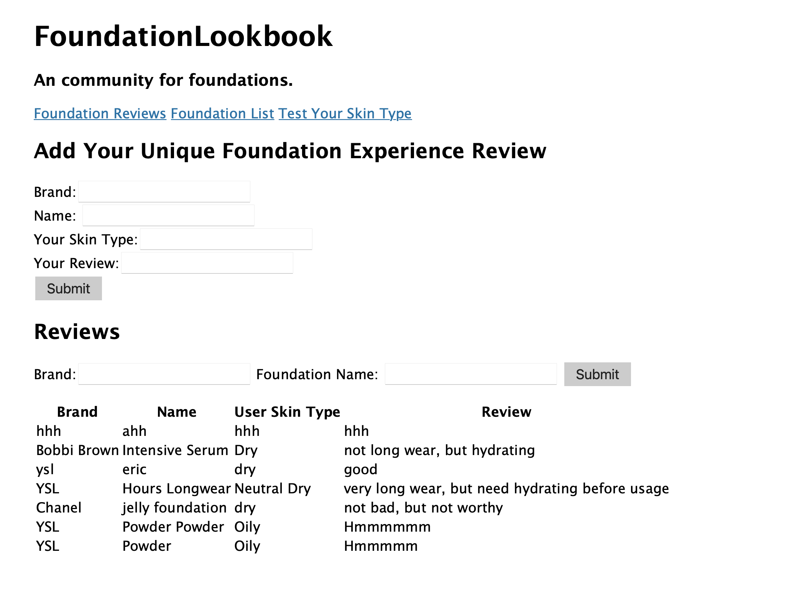
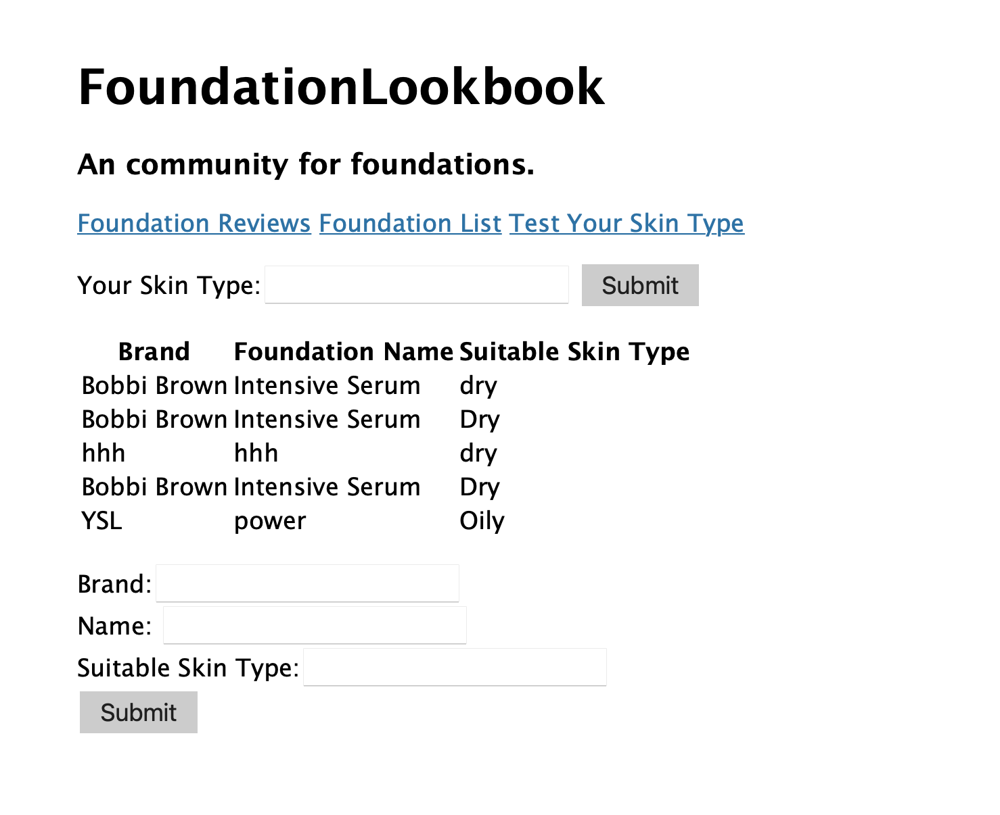

The content below is an example project proposal / requirements document. Replace the text below the lines marked "__TODO__" with details specific to your project. Remove the "TODO" lines.
 
# Foundation Lookbook


## Overview

For girls who do make-up, foundation is the most important part of the process which the suited color, mosie level and coverage can add many points to the entire look and vice versa. 

Foundation Lookbook is a web community that will allow users to test their skin type, find information of foundations and add/find reviews of the specific foundation.  

## Data Model


The application will store Foundations, and Reviews

* Reviews are the review left by user
* Foundations are the information of different foundations


An Example Foundation:

```javascript
{
  brand: //the brand of the foundation,
  name: // the name of the foundation,
  Suitable_Skin: // suggested skin type suitable for this foundation

}
```


An Example Review:

```javascript
{
    brand://brand of the foundation
    FoundationName: //name of the foundation
    skintype://reviewers skin type,
    review://the actual comment
}

```


## [Link to Commented First Draft Schema](db.js) 


## Wireframes


/test - page for testing skin type


/foundatiom - page for review



/list - page for showing the library of foundation



## Site map


## User Stories or Use Cases

1. as a user, I can test my skin type
2. as a user, I can use my skin type information to search for the most-need foundation
3. as a user, I can add my review to a foundation 

## Research Topics


* (2 points) Use tailwind CSS framework throughout site (finish researching, need time to design and apply to site)
    * use a reasonable of customization of the framework
    * make the site beautiful and attractive
* (1 points) Using Bootstrap CSS as well for beautiful icons
* (3 points) Heroku + MongoDB 
    *  I spend a whole night figuring out how Heroku and Atlas MongoDB interact with each other
* (4 points)  Perform client side form validation
    * I gave myself four points on this because I did two places validation
    * if you want to add foundation that already exists in the list, an error message will appear in the dom
    * if you enter things other than 1/2 for yes/no, an error message will appear on dom

12 points total out of 8 required points 


## [Link to Initial Main Project File](app.js) 

## Annotations / References Used

1. [CSS framework](https://tailwindcss.com) - (add link to source code that was based on this)


