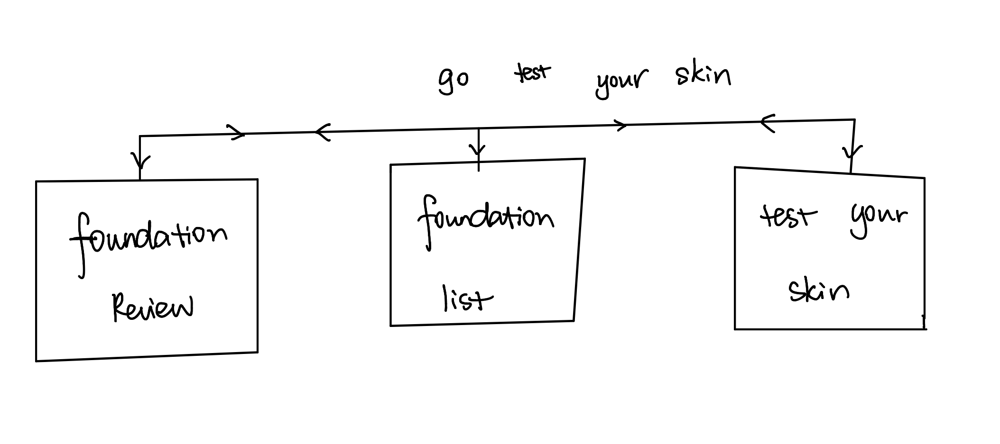

The content below is an example project proposal / requirements document. Replace the text below the lines marked "__TODO__" with details specific to your project. Remove the "TODO" lines.
 
# Foundation Picker


## Overview

For girls who do make-up, foundation is the most important part of the process which the suited color, mosie level and coverage can add many points to the entire look and vice versa. 

Foundation Picker is a web app that will allow users to enter their needs of foundation according to several conditions and give them the best matches by their skin types for different occasions(everyday/party) and seasons(summer/winter). 

## Data Model

(__TODO__: a description of your application's data and their relationships to each other_) 

The application will store Users, Skin Conditions, Foundations, and Characteristic of Foundations

* user should enter their face conditions to generate the skin type
* each user has specific one skin conditions (via references)
* each user can enter one occasion and one season each time of searching, for example, user A wants a foundation for a summer party 
* one specific characteristic of the foundation can link to multiple skin type/occasion/season, for example, longwear can match oil skin, summer and party
* each foundation can have multiple characteristics
* at the end, the best matches would be the foundation that have the characteristics which can fulfill all the users' condition(skin, season and ocassion)

(__TODO__: sample documents_)

An Example User:

```javascript
{
  username: "shannonshopper",
  hash: // a password hash,
  face_condition: // an array of the input of face conditions that user enters,
  skin_type://the skin type matched to the user that stored in the user profile
}
```


An Example Skintype:

```javascript
{
  skin_type: //a reference to user's skintype ,
  keywords: //an array of specific face condition that the user enters,
}

```

An Example Information of Foundation:

```javascript
{
  name: //the name of the foundation,
  brand: // the brand of the foundation,
  characteristics: //an array of characteristics of foundation 
}
```

An Example Matching between characteristic and corresponding conditions:
```javascript
{
 characteristics1: //an array of conditions like skintype, season and ocassion of usage
 characteristics2: //an array of conditions 
 ...
}
```
An Example Requirement:
```javascript
{
 username: //with skintype stored
 occasion: //with ocassion usage the user choose
 season: //the season that user choose
}
```

## [Link to Commented First Draft Schema](db.js) 

(__TODO__: create a first draft of your Schemas in db.js and link to it_)

## Wireframes


/test - page for testing skin type


/matching - page for match the perfect foundation


/introduction - page for showing the brief introduction of the best match


## Site map




## User Stories or Use Cases

1. as non-registered user, I can register a new account with the site 
2. as a user, I can log in to the site
3. as a user, I can test and store my skin type
4. as a user, I can use my information to test the most-need foundation
5. as a user, I can retest my skintype
6. as a user, I can view the information of the foundation matched and go to the official website of it

## Research Topics

* (2 points) Use a CSS framework throughout site
    * use a reasonable of customization of the framework
    * make the site beautiful and attractive
* (4 points) Perform client side form validation using a JavaScript library
    * if the client put in the skin type that is not consistent with the profile store, error message occur
    * ask to go back to the test page to test again
* (5 points) vue.js
    * used vue.js as the frontend framework

11 points total out of 8 required points 


## [Link to Initial Main Project File](app.js) 

## Annotations / References Used

1. [passport.js authentication docs](http://passportjs.org/docs) - (add link to source code that was based on this)
2. [tutorial on vue.js](https://vuejs.org/v2/guide/) - (add link to source code that was based on this)

